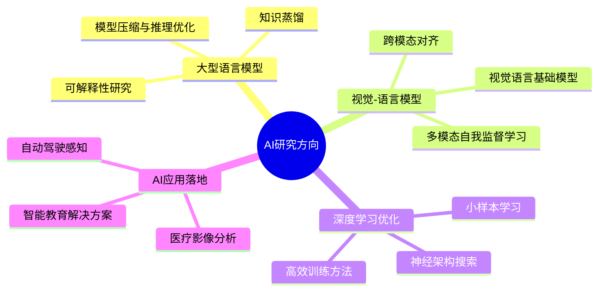

<div align="center">
  
#  欢迎来到我的GitHub, 我是 B143KC47

[](https://git.io/typing-svg)


[](https://github.com/B143KC47?tab=followers)
[](https://github.com/B143KC47?tab=repositories)
[](https://github.com/B143KC47)

</div>

##  关于我 


- 🔭 **工作重心:** 专注于大语言模型和视觉-语言模型的研发，致力于提升模型效率和泛化能力
- 🌐 **个人网站:** [网站](https://b143kc47.github.io) | [博客](https://b143kc47.github.io/blog)
- 🌱 **学习方向:** 多模态AI和先进计算机视觉技术在实际应用中的落地
- 🤝 **合作邀请:** 欢迎AI/ML研究项目的合作，特别是涉及创新方法解决复杂问题的项目
- 💡 **兴趣领域:** NLP、计算机视觉、VLM和AI应用，致力于开发对社会有益的AI解决方案
- 🎯 **2024目标:** 为AI开源项目做出更多贡献，发表研究论文，构建有影响力的AI应用

##  技术栈 

<details open>
<summary>点击查看详细技术栈</summary>
<br>

### 💻 编程语言


### 🧠 AI/ML框架


### 🛠️ 开发工具与环境


### 📊 数据分析与可视化


</details>

## 📈 GitHub统计数据

<div align="center">
  
  
</div>

<div align="center">
  
</div>

## 🎯 精选AI项目

<div align="center">
  <a href="https://github.com/B143KC47/CityU_GenAi_AIcademy">
    
  </a>
  <a href="https://github.com/B143KC47/nlp-learning-resources">
    
  </a>
</div>

<details>
  <summary>📝 项目详情</summary>
  
### NLP学习工具
一个帮助学生学习和实践自然语言处理概念的NLP项目。该工具提供了从基础到高级的NLP知识体系，包含实战案例和互动练习。
  
### 相关资源
- 🔗 [NLP学习路径](https://b143kc47.github.io/blog/nlp-learning-path)
- 🔗 [实战项目展示](https://b143kc47.github.io/blog/nlp-projects)
- 📚 [推荐学习资料](https://b143kc47.github.io/blog/nlp-resources)
</details>

## 🔬 研究兴趣


## 💻 编程能力

```
Computer Vision   ███████████████░░░   80% 🔍
NLP               ████████████████░░   85% 📝
MLOps             ████████████░░░░░░   65% 🚀
Deep Learning     ███████████████░░░   80% 🧠
VLM               ██████████░░░░░░░░   55% 👁️
```

## 🔥 活跃度统计

<div align="center">
  
[](https://github.com/B143KC47)

</div>

## 📊 本周编码时间

<!--START_SECTION:waka-->
```text
开发中...
```
<!--END_SECTION:waka-->

## 📝 最新博客文章
<!-- BLOG-POST-LIST:START -->
<!-- BLOG-POST-LIST:END -->

<div align="center">

## 🏆 GitHub成就


## 📫 联系我

<a href="mailto:s20200057@ylmass.edu.hk">
  
</a>
<a href="https://github.com/B143KC47">
  
</a>
<a href="https://www.linkedin.com/in/blackcat/?originalSubdomain=hk">
  
</a>
<a href="https://b143kc47.github.io">
  
</a>
<a href="https://b143kc47.github.io/blog">
  
</a>

## 👀 访问计数
  


</div>
````
