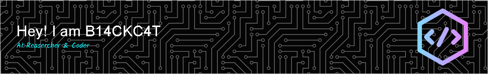

# 
Welcome to My GitHub Space

### AI Engineer | Deep Learning Explorer | NLP & Computer Vision Developer

 

  
  
  

 

## About Me

#### 🎯 Current Focus
- Researching **Large Language Models (LLMs)** and **Vision-Language Models (VLMs)**
- Exploring cutting-edge **Multimodal AI** and **Computer Vision** technologies
- Contributing to open-source AI/ML projects

#### 💡 Areas of Expertise
- Natural Language Processing (NLP)
- Computer Vision
- Vision-Language Models
- Deep Learning Frameworks

#### 🎯 2024 Goals
- Contribute meaningful code to open-source AI projects
- Publish research papers in top-tier conferences
- Build scalable AI systems for real-world applications

#### 🧠 Active Projects
- LLM Framework Development and Optimization
- Personal Technical Blog Website Construction
- Research and Implementation of Novel AI Architectures

 

## 📊 Coding Statistics

  

<!--START_SECTION:waka-->

 Last Updated on 31/08/2025 01:00:10 UTC
<!--END_SECTION:waka-->

 

## Tech Stack

#### Languages

  
  
  
  
  
  
  
  

#### Development Tools

  
  
  
  
  
  
  

#### AI/ML Frameworks

  
  
  
  
  
  

#### Cloud & DevOps

  
  
  
  
  
  

#### AI Tools

  
  
  
  
  

#### Operating Systems

  
  
  
  

 

## Contact

  

 

  

