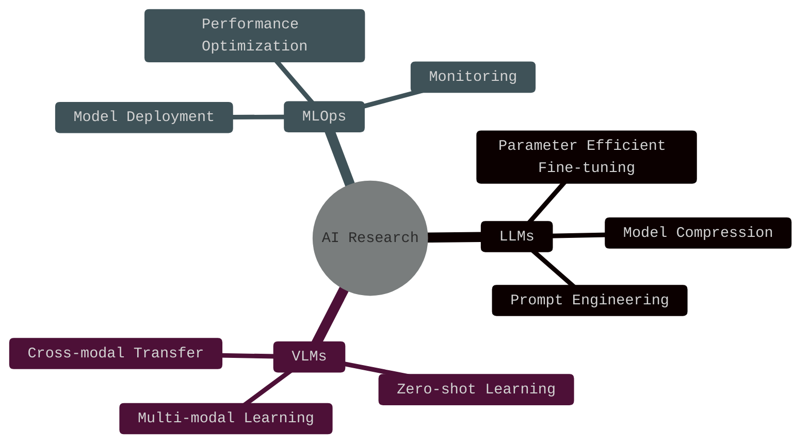

# 
🌟 欢迎来到我的 GitHub 空间

  

## 🤖 关于我

<table>
<tr>
<td width="60%">

### 🎯 个人简介
- 🔭 正在专注于 **LLMs** 和 **VLMs** 的研究
- 🌱 探索 **多模态AI** 和 **计算机视觉** 技术
- 🤝 期待在 AI/ML 研究项目上的合作
- 💡 擅长: **NLP**, **计算机视觉**, **VLM**
- 🎯 2024目标: 为开源项目贡献代码，发表研究论文

</td>
<td width="40%">

### 📊 编码目標
- LLM 框架
- Website
- AI 新架构
- AI Learning Tech
</td>
</tr>
</table>

## 📊 GitHub 统计

<table style="background-color: #0d1117; border-radius: 10px; overflow: hidden;">
<tr>
<td width="50%" align="center">

</td>
<td width="50%" align="center">

</td>
</tr>
<tr>
<td width="50%" align="center">

</td>
<td width="50%" align="center">

</td>
</tr>
</table>

### 🏆 GitHub 成就

### 📈 活跃度统计

### 💻 编程时间统计

### 🌟 贡献热力图

## 🛠️ 技术栈

### 💻 编程语言 & 工具

### 🛠️ 开发工具

### 🤖 AI/ML 技术栈

### ☁️ 云平台 & DevOps

## 🚀 精选项目

<table>
  <tr>
    <td width="50%">
      <a href="https://github.com/B143KC47/CityU_GenAi_AIcademy">
        
         
        
<strong>CityU GenAI Academy</strong>

        
生成式AI应用研究与开发

      </a>
    </td>
    <td width="50%">
      <a href="https://github.com/B143KC47/VLM_Vision_Helper">
        
         
        
<strong>VLM Vision Helper</strong>

        
视觉语言模型辅助工具

      </a>
    </td>
  </tr>
</table>

## 🔬 研究方向

## 📚 最新博客文章

### 🎯 技术博客
<table style="width: 100%; border-collapse: collapse;">
  <tr>
    <td style="padding: 10px; border: 1px solid #30363d;">
      <a href="https://b143kc47.github.io/blog/post1" style="color: #c792ea; text-decoration: none;">
        <h3>🔮 Exploring Generative AI: Tips and Tricks</h3>
        
深入探讨生成式AI的最佳实践和技巧

      </a>
    </td>
  </tr>
  <tr>
    <td style="padding: 10px; border: 1px solid #30363d;">
      <a href="https://b143kc47.github.io/blog/post2" style="color: #c792ea; text-decoration: none;">
        <h3>🚀 Optimizing Vision-Language Models for Real-World Use</h3>
        
视觉语言模型在实际应用中的优化策略

      </a>
    </td>
  </tr>
</table>

## 📫 联系我 & 支持我

  
  
  
  

  
  

  

