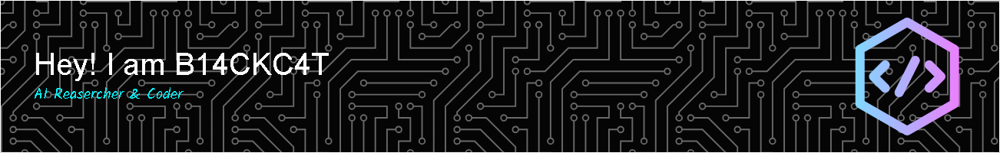

# 
🌟 Welcome to My GitHub Space

  <!-- GitHub Followers & Profile Views Badges -->
  
  
  
  <!-- GitHub Stars Badge -->
  

## 🤖 About Me

<table style="width: 100%; border-collapse: separate; border-spacing: 0 10px; background-color: transparent; border: none;">
<tr style="background-color: transparent; border: none;">
<td width="60%" style="background: linear-gradient(135deg, #1a1b27 0%, #2a2c3e 100%); border-radius: 16px; padding: 20px; border: 1px solid #30363d; box-shadow: 0 4px 8px rgba(0, 0, 0, 0.2);">

<h3 align="center">🎯 Personal Profile</h3>

<table style="width: 100%; border-collapse: collapse; background-color: transparent; border: none;">
<tr style="background-color: transparent; border-bottom: 1px solid #30363d;">
<td align="center" width="15%" style="padding: 10px;"><b>🔭</b></td>
<td style="padding: 10px;">Currently focusing on research in <b>LLMs</b> and <b>VLMs</b></td>
</tr>
<tr style="background-color: transparent; border-bottom: 1px solid #30363d;">
<td align="center" style="padding: 10px;"><b>🌱</b></td>
<td style="padding: 10px;">Exploring <b>Multimodal AI</b> and <b>Computer Vision</b> technologies</td>
</tr>
<tr style="background-color: transparent; border-bottom: 1px solid #30363d;">
<td align="center" style="padding: 10px;"><b>🤝</b></td>
<td style="padding: 10px;">Looking forward to collaborating on <b>AI/ML</b> research projects</td>
</tr>
<tr style="background-color: transparent; border-bottom: 1px solid #30363d;">
<td align="center" style="padding: 10px;"><b>💡</b></td>
<td style="padding: 10px;">Expertise: <b>NLP</b>, <b>Computer Vision</b>, <b>VLM</b></td>
</tr>
<tr style="background-color: transparent;">
<td align="center" style="padding: 10px;"><b>🎯</b></td>
<td style="padding: 10px;">2024 Goals: Contribute code to open-source projects and publish research papers</td>
</tr>
</table>

</td>
<td width="40%" style="background: linear-gradient(135deg, #1a1b27 0%, #2a2c3e 100%); border-radius: 16px; padding: 20px; margin-left: 15px; border: 1px solid #30363d; box-shadow: 0 4px 8px rgba(0, 0, 0, 0.2);">

<h3 align="center">📊 Coding Goals</h3>

<table style="width: 100%; border-collapse: collapse; background-color: transparent; border: none;">
<tr style="background-color: transparent; border-bottom: 1px solid #30363d;">
<td align="center" width="15%" style="padding: 10px;"><b>🧠</b></td>
<td style="padding: 10px;"><b>LLM</b> Framework Development and Optimization</td>
</tr>
<tr style="background-color: transparent; border-bottom: 1px solid #30363d;">
<td align="center" style="padding: 10px;"><b>📝</b></td>
<td style="padding: 10px;">Personal Technical Blog Website Construction</td>
</tr>
<tr style="background-color: transparent; border-bottom: 1px solid #30363d;">
<td align="center" style="padding: 10px;"><b>🔍</b></td>
<td style="padding: 10px;">Exploration and Implementation of New <b>AI</b> Architectures</td>
</tr>
<tr style="background-color: transparent;">
<td align="center" style="padding: 10px;"><b>📚</b></td>
<td style="padding: 10px;">Research and Application of <b>AI</b> Learning Technologies</td>
</tr>
</table>

</td>
</tr>
</table>

## 📊 GitHub Stats

<!-- 使用更简洁的布局，避免出现滚轮 -->

  
  

<!--START_SECTION:waka-->

<!--END_SECTION:waka-->

### 📈 Activity Stats

## 🛠️ Tech Stack

### 💻 Languages

    
    
    
    
    
    
    
    

### 🧰 Development Tools

    
    
    
    
    
    
    

### 🤖 AI/ML Tech Stack

    
    
    
    
    
    

### ☁️ Cloud & DevOps

    
    
    
    
    
    

### 🧠 AI Tools

    
    
    
    

### 💽 OS & Environments

    
    
    
    

## 📫 Contact & Support

<!-- 社交媒体平台 -->

<a href="https://www.instagram.com/b14ckc4t1337/">

<!-- ================================================== -->

<!-- ANIMATED FOOTER -->

  

  

