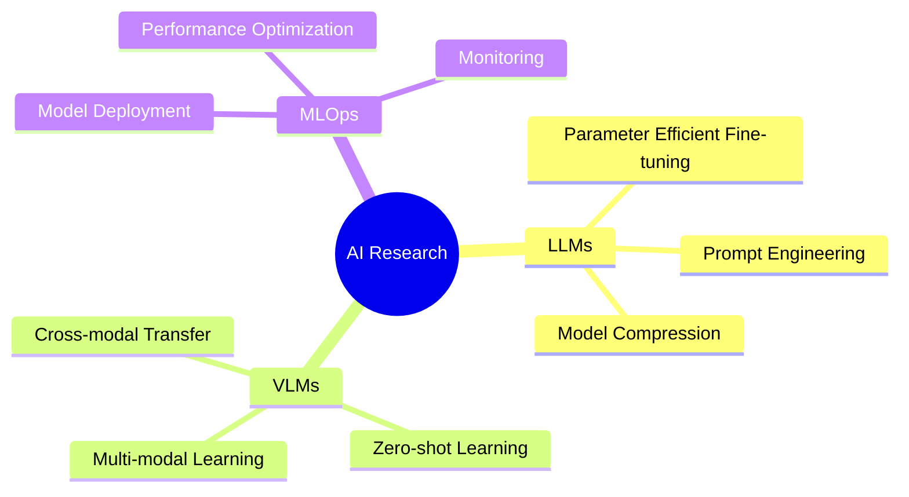

<div align="center">
  


[](https://git.io/typing-svg)


</div>

### 🤖 About Me


- 🔭 I'm currently working on **Large Language Models** and **Vision-Language Models**, focusing on improving their efficiency and generalization capabilities. Check out my work and thoughts on my [website](https://b143kc47.github.io) and [blog](https://b143kc47.github.io/blog).
- 🌱 I'm exploring **Multimodal AI** and **Advanced Computer Vision** techniques for real-world applications.
- 🤝 Open to collaborate on AI/ML research projects, especially those involving innovative approaches to solving complex problems.
- 💡 Interested in: **NLP**, **Computer Vision**, **VLM**, and **AI Applications**, with a passion for developing AI solutions that benefit society.
- 🎯 2024 Goals: Contribute more to AI open-source projects, publish research papers, and build impactful AI applications.

### ��️ Tech Stack 

#### Tech Stack
##### Languages
| Python | C++ | Lua | JavaScript | etc. |
|---|---|---|---|---|
|  |  | ... |

##### AI/ML Frameworks
| PyTorch | TensorFlow | Scikit-learn | Hugging Face | etc. |
|---|---|---|---|---|
|  |  | ... |

##### Tools & Environments
| Docker | CUDA | Linux | Git | etc. |
|---|---|---|---|---|
|  |  | ... |

#### ☁️ Cloud Platforms


### �� GitHub Stats

<div align="center">
  
  
</div>

### 🎯 AI Projects

<div align="center">
  <a href="https://github.com/B143KC47/CityU_GenAi_AIcademy">
    
    <p><strong>CityU GenAI Academy</strong>: A project focused on generative AI applications. Check out related resources and tutorials <a href="https://b143kc47.github.io/blog/genai-resources">here</a>.</p>
  </a>
</div>

### 📫 Connect with Me

<div align="center">
  <a href="mailto:s20200057@ylmass.edu.hk">
    
  </a>
  <a href="https://github.com/B143KC47">
    
  </a>
  <a href="https://www.linkedin.com/in/blackcat/?originalSubdomain=hk">
    
  </a>
  <a href="https://b143kc47.github.io">
    
  </a>
  <a href="https://b143kc47.github.io/blog">
    
  </a>
</div>

### 👀 Visitor Count


### ⚡ Recent Activity
<!--START_SECTION:activity-->
1. 🎉 Merged PR in repository
2. 💪 Opened PR in repository
3. ⭐ Starred repository
<!--END_SECTION:activity-->

### 🔥 Streak Stats
[](https://git.io/streak-stats)

### 💻 Skills Progress

```text
Computer Vision   ███████████████░░░   80%
NLP               ████████████████░░   85%
MLOps             ████████████░░░░░░   65%
Deep Learning     ███████████████░░░   80%
VLM               ██████████░░░░░░░░   55%
```

### 📊 Yearly Development Breakdown

```text
Blog                4 hrs 32 mins   ████████████░░░░   60%
Personal Website    2 hrs 5 mins    ██████████████░░   100%
Gym_helper          18 mins         ████░░░░░░░░░░░░   20%
VLM_Vision_Helper   8 mins          ██░░░░░░░░░░░░░░   15%
```

### 🏆 GitHub Profile Trophy

<p align="center">
  <a href="https://github.com/ryo-ma/github-profile-trophy">
    
  </a>
</p>

<div align="center">

[](https://git.io/typing-svg)


</div>

### 🔬 Research Interests
- **Large Language Models (LLMs)**
- **Vision-Language Models (VLMs)**
- **Multimodal Deep Learning**
- **Neural Architecture Search**
- **AI Model Optimization**

### 📚 Latest AI Blog Posts
<!-- BLOG-POST-LIST:START -->
- [Exploring Generative AI: Tips and Tricks](https://b143kc47.github.io/blog/post1)
- [Optimizing Vision-Language Models for Real-World Use](https://b143kc47.github.io/blog/post2)
<!-- BLOG-POST-LIST:END -->

### 📈 Contribution Graph


### 🌟 Current Focus



### 🎯 Weekly Development Breakdown

```text
AI Research     ██████████░░░░░░   50.00 %
MLOps           ████████░░░░░░░░   40.00 %
Documentation   ██░░░░░░░░░░░░░░   10.00 %
```

<div align="center">
  
</div>


