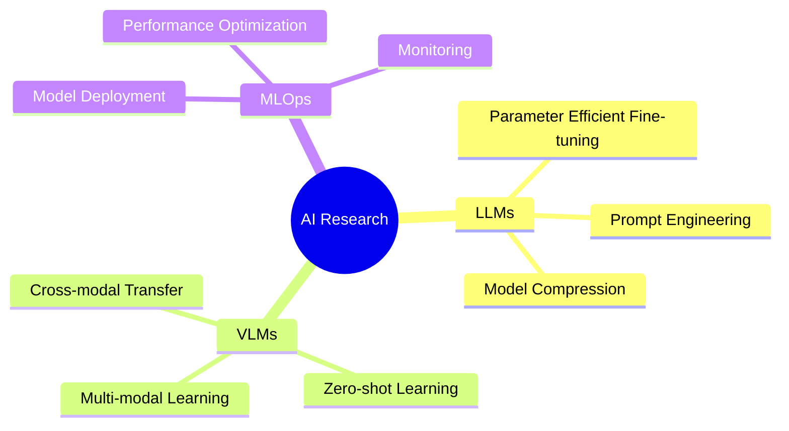

# <div align="center">🌟 欢迎来到我的 GitHub 空间</div>

<div align="center">
  


<a href="https://git.io/typing-svg"></a>


</div>

## 🤖 关于我

<table>
<tr>
<td width="60%">

### 🎯 个人简介
- 🔭 正在专注于 **LLMs** 和 **VLMs** 的研究
- 🌱 探索 **多模态AI** 和 **计算机视觉** 技术
- 🤝 期待在 AI/ML 研究项目上的合作
- 💡 擅长: **NLP**, **计算机视觉**, **VLM**
- 🎯 2024目标: 为开源项目贡献代码，发表研究论文

### 🎵 最近在听
[](https://open.spotify.com/user/your_spotify_id)

</td>
<td width="40%">


### 📊 编码时间
```text
AI Research     ████████████░░   75%
MLOps          ████████░░░░░░   50%
文档编写        ██████░░░░░░░░   40%
```
</td>
</tr>
</table>

<details open>
<summary><b>🤖 关于我</b></summary>
<br>


### 🎯 当前状态

```text
🔭 正在学习     Vision Language Models
🌱 正在研究     Multimodal AI Systems
👯 期待合作     AI/ML Research Projects
🤔 在思考      How to make AI more efficient
💬 可以询问     LLMs, CV, MLOps
⚡ 有趣的事     I love exploring new AI papers
```

</details>

### 🤖 About Me

<div align="right">
  
[](https://open.spotify.com/user/your_spotify_id)

</div>


### 🎯 当前状态

```text
🔭 正在学习     Vision Language Models
🌱 正在研究     Multimodal AI Systems
👯 期待合作     AI/ML Research Projects
🤔 在思考      How to make AI more efficient
💬 可以询问     LLMs, CV, MLOps
⚡ 有趣的事     I love exploring new AI papers
```

<details>
<summary><h2>🎯 Tech Stack</h2></summary>

<div align="center">

#### 💻 编程语言


#### 🤖 AI/ML 框架


#### 🛠️ 开发工具


#### ☁️ 云平台


</div>

</details>

## 🚀 精选项目

<div align="center">
<table>
  <tr>
    <td width="50%">
      <a href="https://github.com/B143KC47/CityU_GenAi_AIcademy">
        
        <br>
        <p align="center"><strong>CityU GenAI Academy</strong></p>
        <p align="center">生成式AI应用研究与开发</p>
      </a>
    </td>
    <td width="50%">
      <a href="https://github.com/B143KC47/VLM_Vision_Helper">
        
        <br>
        <p align="center"><strong>VLM Vision Helper</strong></p>
        <p align="center">视觉语言模型辅助工具</p>
      </a>
    </td>
  </tr>
</table>
</div>

## 📫 联系我 & 支持我

<div align="center">
  <a href="mailto:s20200057@ylmass.edu.hk">
    
  </a>
  <a href="https://github.com/B143KC47">
    
  </a>
  <a href="https://www.linkedin.com/in/blackcat/?originalSubdomain=hk">
    
  </a>
  <a href="https://b143kc47.github.io">
    
  </a>
  
  ### 🎁 支持我的工作
  <a href="https://www.buymeacoffee.com/your_username">
    
  </a>
  <a href="https://ko-fi.com/your_username">
    
  </a>
</div>

<div align="center">
  
  
  
  
  
</div>

<details>
<summary><h2>⚡ Recent Activity</h2></summary>

### ⚡ Recent Activity
<!--START_SECTION:activity-->
1. 🎉 Merged PR in repository
2. 💪 Opened PR in repository
3. ⭐ Starred repository
<!--END_SECTION:activity-->

</details>

<details>
<summary><h2>🔥 Streak Stats</h2></summary>

### 🔥 Streak Stats
[](https://git.io/streak-stats)

</details>

<details>
<summary><h2>📊 Yearly Development Breakdown</h2></summary>

### 📊 Yearly Development Breakdown

```text
Blog                4 hrs 32 mins   ████████████░░░░   60%
Personal Website    2 hrs 5 mins    ██████████████░░   100%
Gym_helper          18 mins         ████░░░░░░░░░░░░   20%
VLM_Vision_Helper   8 mins          ██░░░░░░░░░░░░░░   15%
```

</details>

<details>
<summary><h2>🏆 GitHub Profile Trophy</h2></summary>

### 🏆 GitHub Profile Trophy

<p align="center">
  <a href="https://github.com/ryo-ma/github-profile-trophy">
    
  </a>
</p>

</details>

<details>
<summary><h2>🔬 Research Interests & 📚 Latest AI Blog Posts</h2></summary>

<div align="center">

[](https://git.io/typing-svg)


</div>

### 🔬 Research Interests
- **Large Language Models (LLMs)**
- **Vision-Language Models (VLMs)**
- **Multimodal Deep Learning**
- **Neural Architecture Search**
- **AI Model Optimization**

### 📚 Latest AI Blog Posts
<!-- BLOG-POST-LIST:START -->
- [Exploring Generative AI: Tips and Tricks](https://b143kc47.github.io/blog/post1)
- [Optimizing Vision-Language Models for Real-World Use](https://b143kc47.github.io/blog/post2)
<!-- BLOG-POST-LIST:END -->

</details>

<details>
<summary><h2>📈 Contribution Graph & 🌟 Current Focus</h2></summary>

### 📈 Contribution Graph


### 🌟 Current Focus



</details>

<details>
<summary><h2>🎯 Weekly Development Breakdown & 📊 GitHub 统计 & ⚡ 活跃度</h2></summary>

### 🎯 Weekly Development Breakdown

```text
AI Research     ██████████░░░░░░   50.00 %
MLOps           ████████░░░░░░░░   40.00 %
Documentation   ██░░░░░░░░░░░░░░   10.00 %
```

### 📊 GitHub 统计

<table>
<tr>
<td>
  

  
</td>
<td>
  

  
</td>
</tr>
</table>

### 🔥 连续提交记录
[](https://git.io/streak-stats)

### 📈 贡献图


### 🏆 GitHub 成就


</details>

<details>
<summary><h2>🎯 Weekly Development Breakdown & 📊 GitHub 统计 & ⚡ 活跃度</h2></summary>

### 🎯 Weekly Development Breakdown

```text
AI Research     ██████████░░░░░░   50.00 %
MLOps           ████████░░░░░░░░   40.00 %
Documentation   ██░░░░░░░░░░░░░░   10.00 %
```